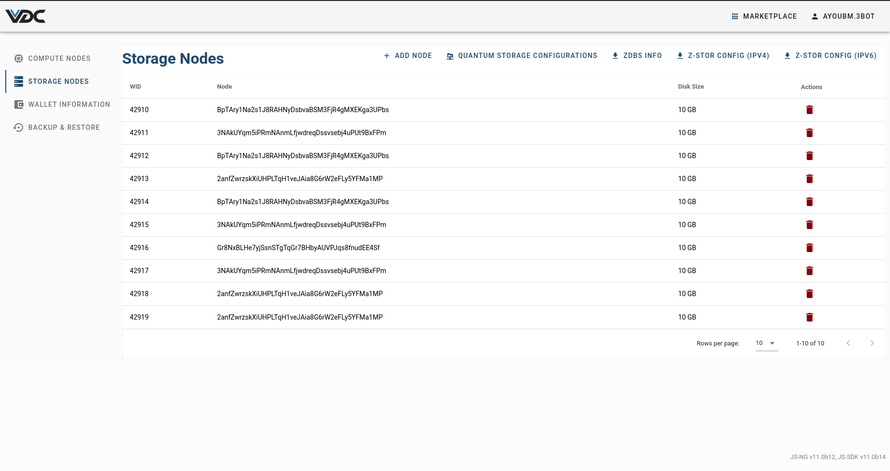

# VDC Deployer

This manual will go through the `VDC_dashboard` package and how to add new solutions to its marketplace.

- The `VDC dashboard` is the end user interface, where the user can interact with their VDC Settings and Marketplace.

## Requirement
- At lest One VDC instance configured on the machine.

## The VDC dashboard architecture
```
  ├── chats
  ├── scripts
  ├── bottle
  │   └── deployments.py
  │   └── backup.py
  │   └── models.py
  │   └── vdc_helpers.py
  ├── services
  │   └── domain.py
  │   └── etcd_backup.py
  │   └── k8s_auto_extend.py
  │   └── provisioning_wallet_billing.py
  │   └── s3_auto_topup.py
  │   └── transaction_from_prepain_to_provisioning.py
  │   └── zdb_auto_topup.py
  ├── frontend
  │   └── assets
  │   └── components
  │   └── index.js
  │   └── api.js
  │   └── index.html
  │   └── app.vue
  ├── package.py
  ├── package.toml
  └── __init__.py
  ```

### Background Services
- `domain.py`: This service is responsible for redeploy subdomain.
- `etcd_backup.py`: This service is responsible for use `etcdctl` to get a snapshot of etcd and back it up using `restic`, *it stopped for now*
- `k8s_auto_extend.py`: This service is responsible for auto extend the kubernetes cluster to its plan limits if needed.
- `provisioning_wallet_billing.py`: This service is responsible for extend the VDC pool.
- `s3_auto_topup.py`: *it stopped for now*
- `transaction_from_prepain_to_provisioning.py`: This service is responsible for transfer funds from prepaid to provision wallet
- `zdb_auto_topup.py`: This service is responsible for extend the VDC ZDBs capacity.

### REST APIs
- [REST Interfaces](./vdc_dashboard_rest_interface.md) are available that allow the user to perform VDC related actions to control and monitor their VDC.
- Some actions can be applied with the REST APIs like:
  - `Get all VDC info`: `<YOUR_VDC_DOMAIN>/api/controller/vdc`
  - `Get all worker nodes`: `<YOUR_VDC_DOMAIN>/api/controller/node/list`
  - `Add new worker node`: `<YOUR_VDC_DOMAIN>/api/controller/node/add`
  - `Delete existing worker node`: `<YOUR_VDC_DOMAIN>/api/controller/node/delete`
  - `Get all storage nodes`: `<YOUR_VDC_DOMAIN>/api/controller/zdb/list`
  - `Add new storage node`: `<YOUR_VDC_DOMAIN>/api/controller/zdb/add`
  - `Delete storage node`: `<YOUR_VDC_DOMAIN>/api/controller/zdb/delete`
  - `Get vdc prepaid wallet info`: `<YOUR_VDC_DOMAIN>/api/controller/wallet`
  - `Get all used pools`: `<YOUR_VDC_DOMAIN>/api/controller/pools`
  - `Get alerts`: `<YOUR_VDC_DOMAIN>/api/controller/alerts`
### The Package Frontend
- The frontend is built with [Vue js](https://vuejs.org/) using some components from [vuetify js](https://vuetifyjs.com/).

- The VDC Marketplace home page:
  - The user can deploy, list, and delete their solutions.


- The VDC setting home page:
  - `Compute Nodes tab` is the default tab for the VDC Kubernetes cluster, where the user can add or remove their VDC's nodes.
  
  - In the `Storage Nodes` tab the user can:
    - Add/Delete storage nodes.
    - Enable quantum storage.
    - Download [Z-stor](https://github.com/threefoldtech/0-stor_v2) configuration.
    - Download ZDBs information.

    

  - `Wallet Information tab`: consists of the prepaid wallet information.

    

  - `Backup And Restore tab`: consists of a list of backups. It also enables the user to create new ones or restore any of the previously backed up ones.

    

### Adding New Solution Chatflow
- please see this documentation: [Add Marketplace Solution Chatflow](../wiki/tutorials/add_marketplacevdc_chatflow.md)
